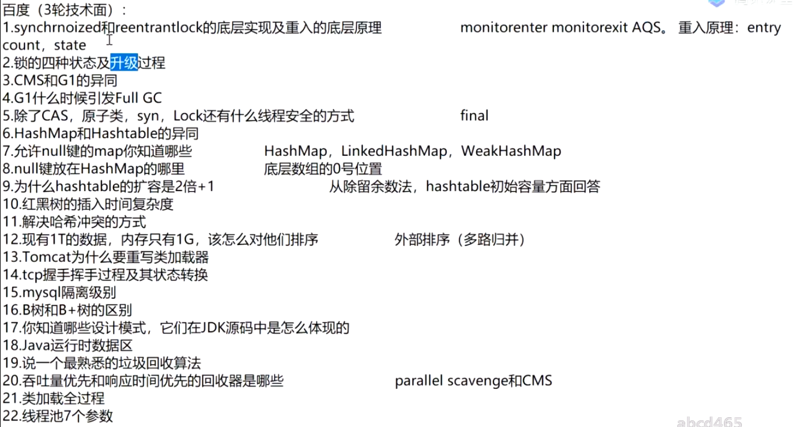

### 线程状态

### Synchronized 

    synchronized的底层实现/如何保证原子性、有序性和可见性
    ：
    锁的是对象不是代码， 锁对象的信息存放在对象头Mark Word(对象头)中
    当获取锁时，通过Monitorenter指令(同步代码块，同步方法是用Acc_synchronized标记符控制锁和释放)对Monitor进行加锁，加锁后其他线程无法获得锁
    直到所有代码执行完再通过Monitorexit指令释放锁
    
    （有序性： 程序执行的顺序按照代码的先后顺序执行  可见性：执行完成后会进行解锁，解锁之前，将变量同步回主存中，保证其他线程可见）
    
    锁升级的概念： 偏向锁->自旋锁(轻量级锁)->重量级锁
    过程：
    markword（对象头） 记录这个线程ID （为偏向锁）
    如果线程争用：升级为 自旋锁
    默认自旋10次以后，  升级为重量级锁 - OS
    
    （通过锁升级可知）：执行时间短（加锁代码），线程数少，用自旋
                     执行时间长，线程数多，用系统锁

### Volatile [?v?l?ta?l]

    保证线程可见性（缓存一致性协议）
    禁止指令重排序

### 各种JUC同步锁 (c_20)
    ReentrantLock
    CountDownLatch
    CycliBarrier
    Phaser
    ReadWriteLock
    Semaphore
    Exchanger
    LockSupport

###  面试题目：实现容器，add,size...  (c_20)

### AQS （c_20)
 1. AQS源码

### 强软弱虚  （c_22)

### ThreadLocal （c_22)
1. ThreadLocal源码
2. ThreadLocal用途： 声明式事务，如保证一个Connection

### 问题

### 容器（特别是多线程高并发）  （c_25)

List
* CopyOnWriteList
* Vector
* ArrayList
* LinkedList

Set
* HashSet,LinkedHashSet
* SortedSet ,TreeSet
* EnumSet
* CopyOnWriteArraySet
* ConcurrentSkipListSet

Queue
* 不堵塞队列
  * PriorityQueue 基于优先级的无界优先级队列
  * ConcurrentLinkedQueue 基于双向链表结构的无界并发队列
* 堵塞队列
  * Deque ArrayDeque,BlockingDeque,LinkedBlockingDeque
  * BlockingDeque
      * ArrayBlockingQueue  一个由数组支持的有界队列。
      * PriorityBlockingQueue  个由优先级堆支持的无界优先级队列
      * LinkedBlockingQueue  一个由链接节点支持的可选有界队列。
      * TranferQueue  LinkedTransferQueue
      * SynchronousQueue  一个利用 BlockingQueue 接口的简单聚集（rendezvous）机制
* DelayQueue 一个由优先级堆支持的、基于时间的调度队列

Map
* HashMap LinkedHashMap
* TreeMap
* WeakHashMap
* 

